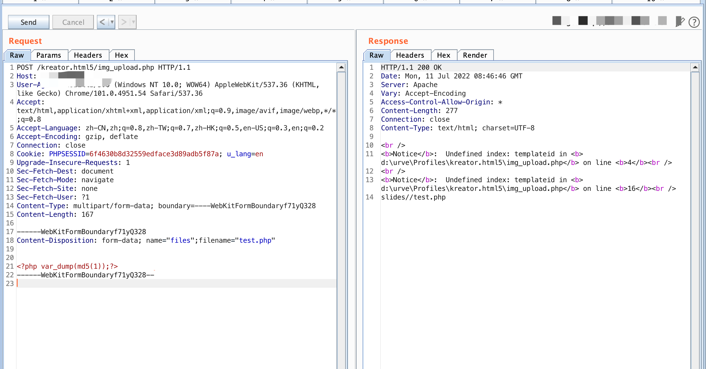
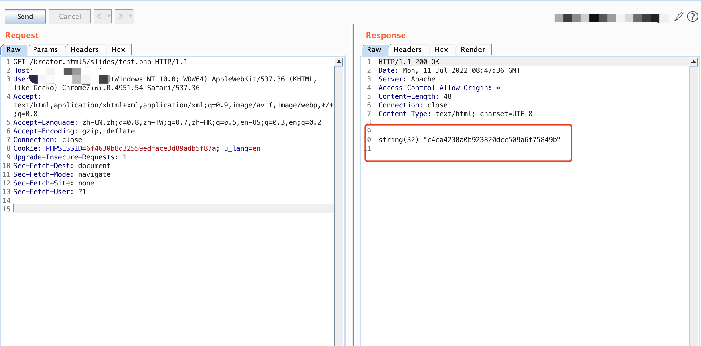

###URVE Web Manager img_upload.php File upload vulnerability

#### Exploit Title: 

URVE Web Manager img_upload.php File upload vulnerability

#### Exploit Author

[webraybtl@webray.com.cn](mailto:webraybtl@webray.com.cn) inc

#### Vendor Homepage

https://eveo.pl/

#### Description

URVE Web Manager img_upload.php has a file upload vulnerability, which can be exploited by attackers to gain system privileges.

#### Payload used:





#### Proof of Concept

```
kreator.html5/img_upload.php
```

```
<?php

$upload_dir = realpath($_SERVER['DOCUMENT_ROOT'])."\\urve\\usersFiles\\slides\\";
$template_dir = realpath($_SERVER['DOCUMENT_ROOT'])."\\kreator.html5\\slides\\".$_POST['templateid']."\\";
if(!is_dir($upload_dir))
{
  mkdir($upload_dir, 0777);
}
if(!is_dir($template_dir)) mkdir($template_dir, 0777);

//echo "Uploading file ".$_FILES['files']['tmp_name'][$key]." to: /urve/usersFiles/slides/".$key.'.'.$extension."\n";
$extension = pathinfo($_FILES['files']['name'], PATHINFO_EXTENSION);
move_uploaded_file($_FILES['files']['tmp_name'], $upload_dir.$_FILES['files']['name']);
copy($upload_dir.$_FILES['files']['name'], $template_dir.$_FILES['files']['name']);

echo 'slides/'.$_POST['templateid'].'/'.$_FILES['files']['name'];


?>
```


