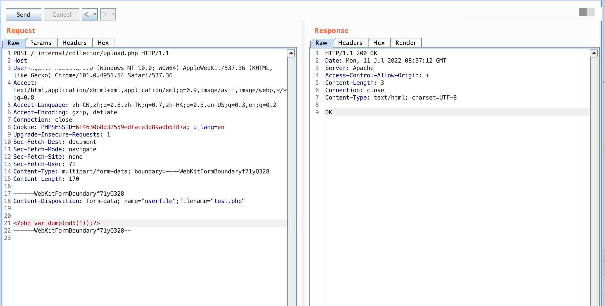
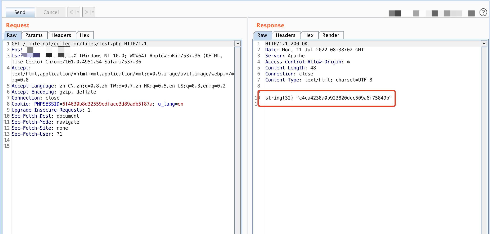

###URVE Web Manager upload.php File upload vulnerability

#### Exploit Title: 

URVE Web Manager upload.php File upload vulnerability

#### Exploit Author

[webraybtl@webray.com.cn](mailto:webraybtl@webray.com.cn) inc

#### Vendor Homepage

https://eveo.pl/

#### Description

URVE Web Manager upload.php  has a file upload vulnerability, which can be exploited by attackers to gain system privileges.

#### Payload used:





#### Proof of Concept

_internal/collector/upload.php

```
<?php


ini_set('error_reporting',  E_ALL & ~E_STRICT & ~E_NOTICE & ~E_DEPRECATED);
error_reporting( E_ALL & ~E_STRICT & ~E_NOTICE & ~E_DEPRECATED);
ini_set('log_errors',TRUE);
ini_set('html_errors',FALSE);
ini_set('error_log','error_u'.date('Ym').'.txt');
ini_set('display_errors',FALSE);

$_path = realpath(dirname(__FILE__));
if(file_exists($_path.'/error_u'.date('Ym').'.txt'))
{
	if(filesize($_path.'/error_u'.date('Ym').'.txt')>900000)
	{
		$i = 0;
		do{
			$i++;
			$file = $_path.'/error_u'.date('Ym').'-'.$i.'.txt';
		}while(file_exists($file));
		@rename($_path.'/error_u'.date('Ym').'.txt', $file);
	}
}

$uploaddir = './files/' . $_POST['PlayerName'] . '/';
MkDir($uploaddir = './files/' . $_POST['PlayerName']);
$uploadfile = $uploaddir . '/' .  $_FILES['userfile']['name'];

if (move_uploaded_file($_FILES['userfile']['tmp_name'], $uploadfile)) {
echo "OK";
	

} else echo "error";

?> 
```


