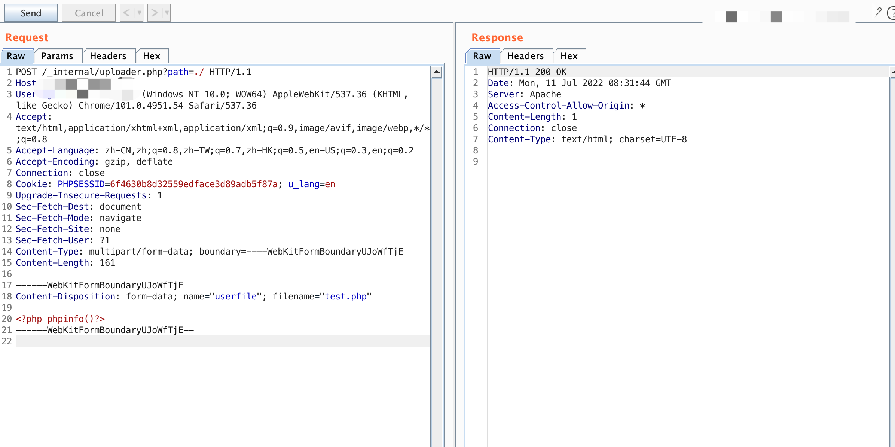
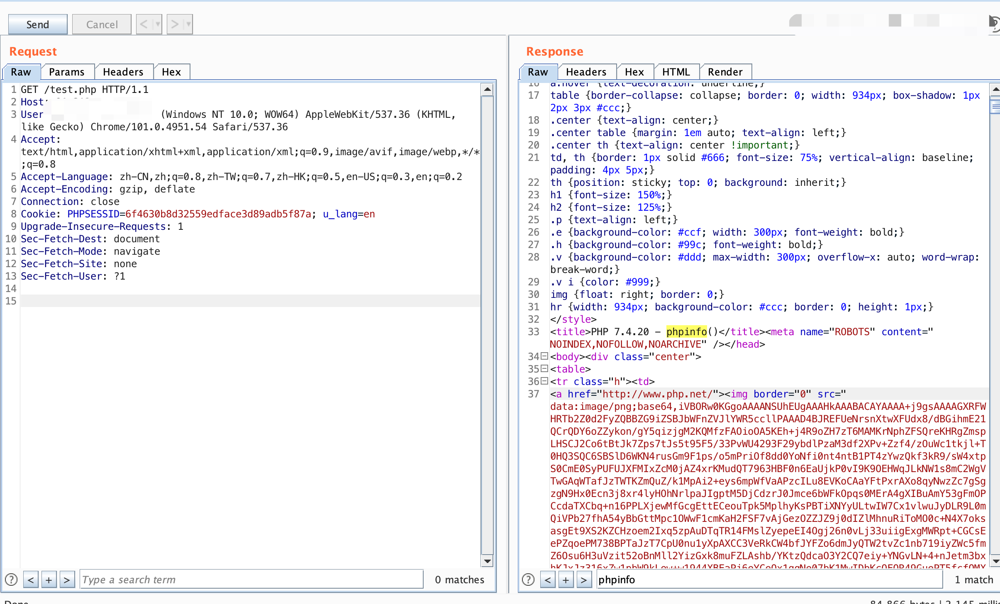

###URVE Web Manager uploader.php File upload vulnerability

#### Exploit Title: 

URVE Web Manager uploader.php File upload vulnerability

#### Exploit Author

[webraybtl@webray.com.cn](mailto:webraybtl@webray.com.cn) inc

#### Vendor Homepage

https://eveo.pl/

#### Description

URVE Web Manager uploader.php has a file upload vulnerability, which can be exploited by attackers to gain system privileges.

#### Payload used:





#### Proof of Concept

_internal/uploader.php

```
if(isset($_FILES['userfile']))
{
	$uploadfile = $uploaddir.'/'. $_FILES['userfile']['name'];//basename($_FILES['userfile']['name']);
	//echo '<pre>';
	//error_log(print_r($_FILES, true)."\n", 3, 'logs.txt');
	if (move_uploaded_file($_FILES['userfile']['tmp_name'], $uploadfile)) {
		//error_log(print_r($uploadfile, true)."\n", 3, 'logs.txt');
		chmod($uploadfile, 0777);
	   // echo "File is valid, and was successfully uploaded.\n";
	} else {
	   // echo "Possible file upload attack!\n";
	}
```


